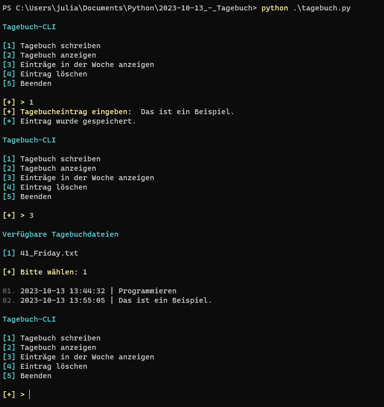

# TagebuchCLI

## Screenshot

## Beschreibung
Mit dem Python Programm kann man ein Tagebuch fürhren.
Die Einträge werden nach Jahr, Monat und Tag sortiert.

## Das benötigt man
- colorama (pip install colorama)

## Platform
- Windows
- Linux
- Mac OS
